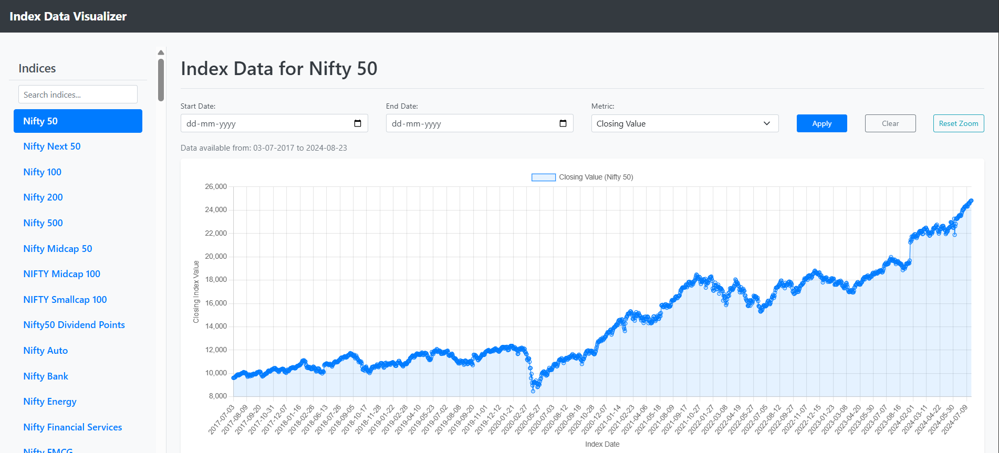
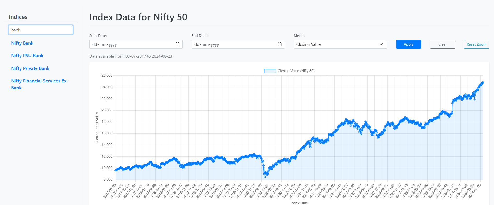
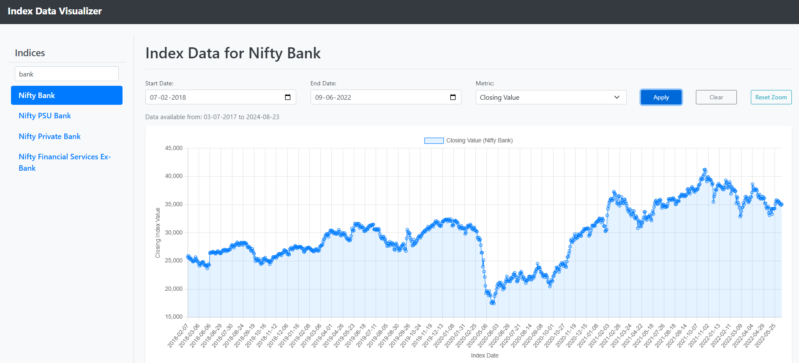
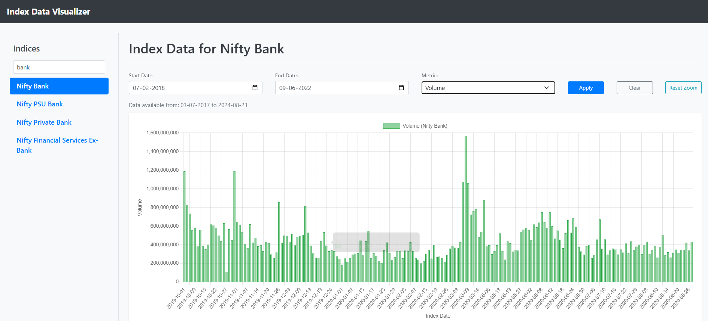
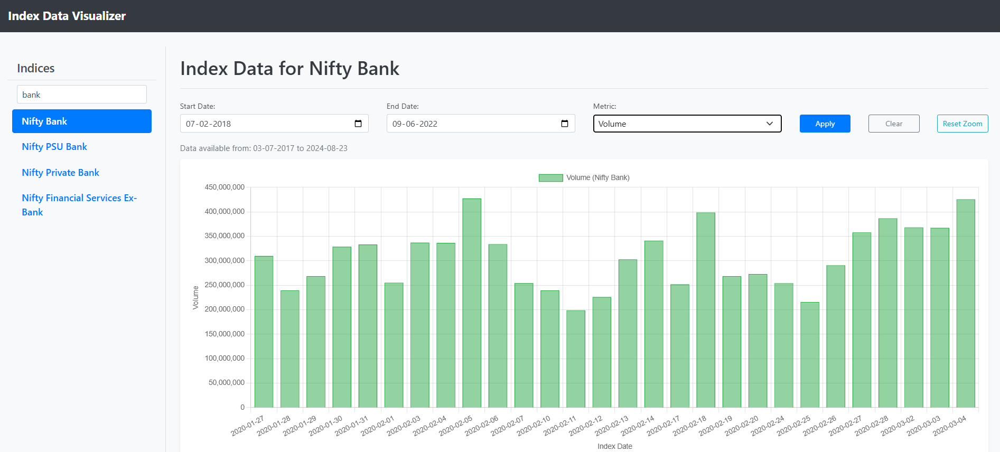

# Index Data Visualizer 📊

A responsive web application to load, browse, search, and visualize financial index data from a CSV file using interactive charts.

## Overview

This project provides a user-friendly interface for exploring time-series data for various financial indices contained within a `dump.csv` file.

Key functionalities include loading the data, displaying a searchable list of indices, rendering interactive line or bar charts based on user-selected metrics (Closing Value or Volume), filtering the chart data by date range, and interacting with the chart via zoom and pan.

---

## ✨ Features

* **CSV Data Loading:** Reads and parses index data from `dump.csv` using PapaParse.
* **Dynamic Index Sidebar:**
    * Displays a list of unique indices found in the data.
    * Includes a real-time **Search Filter** to quickly find specific indices.
* **Interactive Charting (Chart.js):**
    * Renders **Line Charts** (for Closing Value) or **Bar Charts** (for Volume).
    * **Metric Selection:** Dropdown to choose which data column (`closing_index_value` or `volume`) to plot.
    * **Available Date Range Display:** Shows the earliest and latest date available in the data for the selected index.
    * **Date Range Filtering:** Allows users to select a start and end date to focus the chart view.
    * **Zoom & Pan:** Interactive zooming (mouse wheel/pinch) and panning (click/drag) along the time (X) axis, powered by `chartjs-plugin-zoom`.
    * **Reset Zoom:** Button to easily reset the chart's zoom level.
* **Smart Date Handling:** Includes logic to parse date strings, specifically handling potential `DD-MM-YYYY` formats from the CSV for accurate sorting and filtering.
* **Responsive Design:** Adapts layout for different screen sizes using Bootstrap.
* **User Feedback:** Displays loading messages, "no data" messages, and basic error handling.

---

## 📸 Screenshots

*(Placeholder: Add screenshots of your application here!)*

* *(Main interface: Sidebar list + Chart area)*

* *(Search filter in use)*

* *(Date range filter applied)*

* *(Metric switched to Volume (Bar Chart))*

* *(Zoomed-in chart)*



---

## 🚀 Tech Stack / Libraries

* **Frontend:** HTML5, CSS3, JavaScript (ES6+)
* **CSS Framework:** Bootstrap v4.5
* **Charting:** Chart.js (check CDN for version)
* **Chart Plugins:**
    * `chartjs-plugin-zoom` v2.0.1
    * Hammer.js v2.0.8 (dependency for zoom plugin)
* **CSV Parsing:** PapaParse v5.3.0

---

## 📂 Project Structure

## 🔧 Setup and Usage

### Prerequisites

* A modern Web Browser (Chrome, Firefox, Edge, etc.)
* Git (Optional, for cloning)
* A local web server environment (for running the page, see below)

### Getting Started

1.  **Get the Code:**
    * **Option 1: Clone the Repository (if available)**
        Open your terminal and run:
        ```bash
        git clone https://github.com/INCREDIBLE18/company-data-chart-assessment
        cd company-data-chart-assessment
        ```


    * **Option 2: Download Files**
        Download `index.html`, `style.css`, `script.js`, and `dump.csv` into a new folder on your computer.

2.  **Prepare `dump.csv`:**
    * Place your data file named `dump.csv` in the root of the project folder.
    * The file **must** have a header row.
    * **Required Headers:** The script expects these column names:
        * `index_name`
        * `index_date` (Format: `DD-MM-YYYY` or standard formats like `YYYY-MM-DD` are handled)
        * `closing_index_value`
        * `volume`
        * (Also needs `open_index_value`, `high_index_value`, `low_index_value` if you ever add candlestick charts).
    * *If your headers are different, you must update `script.js` accordingly.*

3.  **Running the Application (⚠️ Local Server Required!)**
    * You **cannot** simply open `index.html` directly using `file:///...` because the browser will block loading `dump.csv` due to security reasons (CORS policy).
    * You **must** use a local web server. Here are easy options:

    * **Using VS Code Live Server:**
        1.  Install the "Live Server" extension in VS Code.
        2.  Open your project folder in VS Code.
        3.  Right-click `index.html` -> "Open with Live Server".

    * **Using Python:**
        1.  Open a terminal in your project folder.
        2.  Run `python -m http.server` (for Python 3) or `python -m SimpleHTTPServer` (for Python 2).
        3.  Open your browser to `http://localhost:8000` (or the port shown).

    * **Using Node.js (`http-server`):**
        1.  Install: `npm install -g http-server`
        2.  Open a terminal in your project folder.
        3.  Run: `http-server`
        4.  Open your browser to the URL shown (e.g., `http://localhost:8080`).

---

## 💡 How to Use

1.  **Load:** Open the page via your local server. The index list should populate.
2.  **Search:** Type in the "Search indices..." box to filter the sidebar list.
3.  **Select Index:** Click an index name. The chart area will update, showing the 'Closing Value' line chart and the available date range for that index.
4.  **Filter Data:**
    * Use the **Metric** dropdown to choose between "Closing Value" or "Volume".
    * Select **Start Date** / **End Date**.
    * Click **Apply**. The chart will update.
5.  **Clear Filter:** Click **Clear** to remove date filters and show all data for the current index/metric.
6.  **Interact with Chart:**
    * **Zoom:** Use your mouse wheel or pinch gesture.
    * **Pan:** Click and drag horizontally on the chart.
    * **Reset Zoom:** Click the **Reset Zoom** button.

---

## ⚙️ Code Explanation (`script.js` highlights)

* **Initialization (`DOMContentLoaded`):** Ensures the DOM is ready before script execution. Key variables and DOM element references are set up.
* **Date Helpers (`parseDMYtoDate`, `formatDateToYYYYMMDD`):** Functions specifically added to handle potential `DD-MM-YYYY` date formats found in the CSV, ensuring correct sorting, filtering, and formatting for Chart.js compatibility.
* **Data Loading (`loadCompanyData`):** Uses `Workspace` and `Papa.parse` to asynchronously load and parse the `dump.csv`. Stores result in `allCompanyData`. Handles loading/parsing errors.
* **Sidebar Management (`displayCompanyList`, `filterIndexList`):**
    * `displayCompanyList`: Populates the sidebar with unique `index_name` values (currently unsorted). Attaches click listeners.
    * `filterIndexList`: Provides the real-time search functionality for the sidebar.
* **Charting Logic (`displayChartForCompany`):**
    * The main function triggered by clicking an index or applying filters.
    * Stores the currently selected index name (`currentSelectedIndexName`).
    * Filters `allCompanyData` based on selected index, metric, and date range.
    * Calculates and displays the full available date range for the index.
    * Handles "no data" scenarios gracefully.
    * Destroys the previous Chart.js instance (`currentChart.destroy()`).
    * Prepares `labels` (formatted dates) and `dataValues` for Chart.js.
    * Dynamically configures chart `type`, dataset properties (label, color), and Y-axis options based on the selected metric.
    * Integrates and configures the `chartjs-plugin-zoom` options.
    * Creates the `new Chart(...)` instance.
* **Event Listeners:** Handlers for sidebar clicks, search input (`keyup`), Apply/Clear/ResetZoom buttons, and Metric dropdown (`change`) coordinate UI interactions and trigger chart updates via `displayChartForCompany`.

---

## 🌱 Potential Future Enhancements

* Alphabetically sort the index list in the sidebar.
* Add more metric options to the dropdown (e.g., PE Ratio, Dividend Yield).
* Implement more sophisticated chart types (Candlestick, OHLC - would require revisiting charting library choice).
* Add technical analysis indicators (requires specialized libraries).
* Implement chart drawing tools (lines, annotations - complex).
* Add visual loading indicators (spinners) during data load or chart rendering.
* Performance optimization for extremely large datasets (e.g., data aggregation).
* Save user preferences (selected metric, dates) to Local Storage.